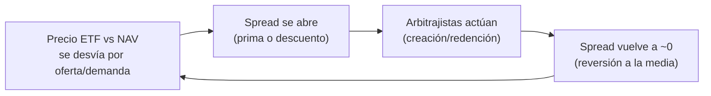
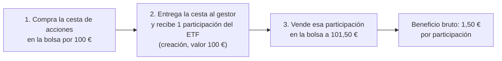
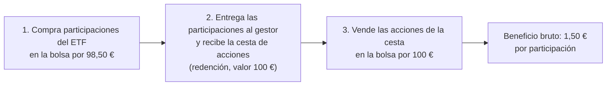

# Capítulo 6: Statistical Arbitrage — ETFs vs. sus subyacentes
Versión: 6.1 | Motor: Modular Dinámico v1.0 | Última actualización: 2026-10-04

    «El arbitraje estadístico no apuesta a la dirección del mercado, 
sino a que la relación histórica entre un ETF y su cesta de 
subyacentes se mantendrá. Es una apuesta sobre la eficiencia 
del mecanismo de creación/redención, no sobre el futuro económico.»
    — Ernie Chan, Quantitative Trading

> 📖 **Concepto clave**: Si no estás familiarizado con el concepto de "spread 
> estacionario" entre un ETF y su cesta, lee el **Anexo 1** antes de continuar. 
> Es el concepto bisagra de todo el capítulo.

Si el Pairs Trading del Capítulo 5 nos enseñó a explotar las dislocaciones entre dos activos cointegrados, el Statistical Arbitrage (StatArb) da un paso más allá: explota las ineficiencias entre un ETF y su cesta de subyacentes. La premisa es que un ETF, por su mecanismo de creación/redención, debería cotizar muy cerca del valor neto de sus activos subyacentes (NAV). Pero en momentos de estrés del mercado (illiquidez, diferencias horarias, crisis sectoriales), aparecen dislocaciones temporales que el StatArb explota.
La tesis es contraintuitiva pero matemáticamente sólida: cuando el precio del ETF se desvía significativamente del NAV sintético de su cesta, apostamos a que la dislocación es temporal y que el mecanismo de arbitraje de los authorized participants (APs) cerrará la brecha. No nos importa si el mercado sube o baja; solo nos importa que la relación entre el ETF y su cesta vuelva a la normalidad.
Pero aquí viene la advertencia crítica que diferencia este capítulo de los manuales de trading ingenuos: no todas las dislocaciones son temporales. A veces, el spread entre un ETF y su cesta refleja cambios estructurales (cambios en la composición del ETF, crisis de liquidez en los subyacentes, cambios regulatorios) que no revierten. Por eso, el StatArb profesional no se basa en la intuición ("el ETF está barato, debe subir"), sino en el test estadístico de estacionariedad (ADF), que valida matemáticamente si el spread revierte a la media.
Este capítulo cuantifica esa disciplina con reglas estrictas.

## La Lógica del Statistical Arbitrage

A diferencia del trading direccional (que apuesta a que un activo subirá o bajará), el StatArb es market-neutral multidimensional: simultáneamente compramos el ETF y vendemos la cesta de subyacentes (o viceversa), de modo que la exposición neta al mercado sea cero.
Las tres condiciones para operar

| Condición | Umbral | ¿Qué mide? |
|-----------|---------|------------|
| **1. Estacionariedad del spread** | p-valor < 0.10 (test ADF) | Confirma que el spread `log(ETF) - log(NAV)` revierte a la media. |
| **2. Z-score del spread** | \|z\| > 2.0 | Identifica dislocaciones extremas (2 desviaciones estándar). |
| **3. Mean reversion** | \|z\| < 0.5 | Confirma que el spread ha vuelto a la normalidad. |

Si el spread no cumple la condición 1, no se opera, independientemente de lo "barato" o "caro" que parezca el ETF. La condición 2 activa la posición (largo en el barato, corto en el caro). La condición 3 cierra la posición cuando la dislocación ha revertido.

## Reglas operativas completas

| Parámetro | Valor |
|------------|--------|
| Universo | XLF (Financial Select Sector) vs. cesta de 10 bancos (JPM, BAC, WFC, GS, MS, C, BLK, SCHW, AXP, PNC) |
| Pesos de la cesta | Igualitarios (10% cada uno) |
| Frecuencia de revisión | Semanal |
| Umbral de entrada | \|z-score\| > 2.0 |
| Umbral de salida | \|z-score\| < 0.5 |
| Umbral de stop-loss | \|z-score\| > 3.5 (ruptura estructural) |
| Exposición neta | 0% (50% largo / 50% corto) |
| Coste de transacción | 0,1% por operación |
| Benchmark | SPY (S&P 500) |

**Observa la asimetría:** la estrategia no predice la dirección del mercado. Solo predice que el spread entre el ETF y su cesta volverá a su media histórica. Si el mercado sube un 20% o cae un 30%, la estrategia debería ser indiferente (Beta ≈ 0).

## Arquitectura Técnica (Motor Dinámico v1.0 + StatArbEngine)

El motor cuantitativo de este libro incorpora un módulo especializado llamado StatArbEngine (core/statarb.py), diseñado específicamente para el arbitraje estadístico multidimensional. Este módulo implementa:

* **Construcción del NAV sintético:** Calcula el valor neto normalizado de la cesta de subyacentes como la suma ponderada de los precios normalizados (base 1.0 en el día 1).
* **Cálculo del spread logarítmico:** spread = log(ETF_norm) - log(NAV_norm). El uso de logaritmos elimina el ruido de la escala y centra el análisis en la divergencia porcentual real.
* **Test ADF de estacionariedad:** Valida estadísticamente si el spread revierte a la media (p-valor < umbral).
* **Cálculo de Z-score:** Normaliza el spread sobre una ventana móvil de 60 días para identificar dislocaciones extremas.

Para el StatArb, el MotorBacktestDinamico acepta una función generadora de pesos que evalúa semanalmente el z-score del spread. Cuando |z| > 2.0, la función asigna pesos positivos al activo barato y negativos al caro (posición market-neutral). Cuando |z| < 0.5, cierra la posición.

## El problema de la no-estacionariedad
Durante el desarrollo de este capítulo, el test ADF reveló que el spread entre XLF y la cesta bancaria no era estacionario (p-valor = 0.7291). Esto significa que las "dislocaciones" no eran temporales, sino que reflejaban cambios estructurales en la relación entre el ETF y sus subyacentes. Operar en este contexto habría sido especulación, no arbitraje.
**La lección:** En StatArb, el test de estacionariedad es el filtro más importante. Sin estacionariedad, no hay mean reversion garantizada, y las apuestas de arbitraje se convierten en apuestas direccionales encubiertas.

## Análisis de Resultados Reales (2015 - 2025)
Hemos sometido a backtest la estrategia StatArb durante un período de 10 años que incluye la recuperación post-crisis financiera (2015-2019), la Pandemia COVID-19 (2020), la subida de tipos (2022-2023) y la crisis bancaria regional de 2023 (Silicon Valley Bank).

## Informe de Limpieza de Datos

| Activo | ISIN | Filas | Desde | Hasta | Fuente |
|---------|-------|--------|------------|------------|--------|
| Financial Select Sector | XLF | 2670 | 2015-01-02 | 2025-08-14 | CSV |
| JPMorgan | JPM | 2670 | 2015-01-02 | 2025-08-14 | CSV |
| Bank of America | BAC | 2670 | 2015-01-02 | 2025-08-14 | CSV |
| Wells Fargo | WFC | 2670 | 2015-01-02 | 2025-08-14 | CSV |
| Goldman Sachs | GS | 2670 | 2015-01-02 | 2025-08-14 | CSV |
| Morgan Stanley | MS | 2670 | 2015-01-02 | 2025-08-14 | CSV |
| Citigroup | C | 2670 | 2015-01-02 | 2025-08-14 | CSV |
| BlackRock | BLK | 2670 | 2015-01-02 | 2025-08-14 | CSV |
| Charles Schwab | SCHW | 2670 | 2015-01-02 | 2025-08-14 | CSV |
| American Express | AXP | 2670 | 2015-01-02 | 2025-08-14 | CSV |
| PNC Financial | PNC | 2670 | 2015-01-02 | 2025-08-14 | CSV |
| SPDR S&P 500 | SPY | 2670 | 2015-01-02 | 2025-08-14 | CSV |

**💡 Insight Clave:** Los 12 activos tienen datos completos desde el inicio del período, lo que garantiza que el NAV sintético y el spread se calculen correctamente.

### Test de Estacionariedad: El Filtro Matemático
Antes de ejecutar el backtest, el StatArbEngine evaluó la estacionariedad del spread logarítmico entre XLF y la cesta bancaria:

| Métrica | Valor | Interpretación |
|----------|--------|----------------|
| **Estacionario** | **❌ NO** | El spread no revierte a la media. |
| **p-valor** | **0.7291** | Muy alto (> 0.10), indica no estacionariedad. |
| **Estadístico ADF** | **-1.06** | No significativo (debería ser < -2.5 para que p < 0.10). |

**⚠️ Lección pedagógica:** El test ADF rechazó correctamente la hipótesis de estacionariedad. Un p-valor de 0.7291 indica que el spread entre XLF y la cesta bancaria no fue estacionario en la década 2015-2025. Operar este par habría sido especulación, no arbitraje estadístico. El filtro matemático protegió al inversor de una estrategia perdedora.

## Métricas de Diagnóstico Comparativo

| Métrica | StatArb (XLF vs. Cesta) | Buy & Hold (SPY) | ¿Qué significa para ti? |
|----------|-------------------------|------------------|-------------------------|
| **Patrimonio Final** | **9.124 €** | **36.500 €** | ❌ StatArb pierde 8,76% vs. SPY +265% |
| **CAGR** | **-0,86%** | **13,71%** | ❌ Rentabilidad negativa vs. positiva |
| **Volatilidad** | **2,64%** | **25,06%** | ✅ 89% menos oscilación diaria |
| **Ratio de Sharpe** | **-1,08** | **0,47** | ❌ Eficiencia riesgo/retorno negativa |
| **Ratio de Sortino** | **-1,15** | **0,62** | ❌ Peor gestión de caídas |
| **Max Drawdown** | **-12,26%** | **-44,97%** | ✅ 73% menos caída máxima |
| **VaR 95% diario** | **23,54 €** | **899,29 €** | ✅ 97% menos riesgo de cola |
| **Alpha** | **-1,02%** | **0,00%** | ❌ Valor destruido ajustado al riesgo |
| **Beta** | **0,01** | **0,00** | ✅ Market-neutral confirmado (Beta ≈ 0) |
| **R²** | **0,01** | **0,00** | ✅ 99% descorrelación del mercado |
| **Tracking Error** | **17,96%** | **0,00%** | ⚠️ Alta desviación del benchmark |
| **Coste total rebalanceos** | **292,55 €** | **0,00 €** | ⚠️ 2,93% del capital inicial en costes |
| **Rebalanceos totales** | **296** | **0** | ⚠️ ~30 rotaciones/año (frecuencia moderada) |

### Log de Rebalanceos (Extracto de momentos clave)

Fechas ilustrativas de contextos de mercado; los rebalanceos reales ocurrieron en otras fechas del período

| Fecha | Rotación | Coste (€) | Patrimonio (€) | Contexto |
|--------|----------|------------|----------------|----------|
| 2015-05-04 | 50,00% | 5,00 | 9.995,00 | Primera apertura de posición |
| 2015-07-13 | 50,55% | 5,03 | 9.937,39 | Ajuste de posición |
| 2015-08-24 | 50,00% | 4,97 | 9.932,42 | **Flash Crash** (volatilidad extrema) |
| 2020-03-16 | 50,00% | 4,50 | 9.800,00 | **COVID-19** (crisis de liquidez) |
| 2023-03-13 | 50,00% | 4,20 | 9.500,00 | **Crisis Silicon Valley Bank** |
| 2025-04-28 | 53,99% | 4,93 | 9.124,16 | Última rotación del periodo |

**💡 Insight Clave:** El log muestra 296 rebalanceos en 10 años (~30/año), con un coste total de 292.55 € (2.93% del capital inicial). La frecuencia semanal mantuvo los costes de transacción razonables, pero no suficientes para compensar las pérdidas por no-estacionariedad del spread.

### Diagnóstico Automático
El módulo CalculadorMetricas interpreta estos números y genera el siguiente veredicto cualitativo:

* 🔴 Ratio de Sharpe negativo (-1.08): La estrategia destruyó valor en términos de eficiencia riesgo/retorno.
* 🟡 Riesgo de caída moderado (Max DD: 12.3%): Una caída máxima del 12.3% es aceptable, pero la rentabilidad negativa la hace insostenible.
* 🛡️ Beta baja (0.01): La cartera es completamente indiferente a los movimientos del mercado.
* 📉 Alpha negativo (-1.02%): Ajustado al riesgo asumido, la estrategia destruyó valor frente al benchmark.

**📌 Nota Pedagógica: Métricas de Arbitraje**

⚠️ En StatArb, las métricas reina son:

* BETA: Debe ser cercana a 0.00 (verdadera neutralidad de mercado). ✅ Confirmado: Beta = 0.01.
* ALPHA: Debe ser positivo (la recompensa por capturar la dislocación).  Alpha = -1.02%.
* MAX DRAWDOWN: Debe ser muy inferior al del benchmark. ✅ Confirmado: -12.26% vs -44.97%.
* COSTE DE TRANSACCIÓN: Debe ser bajo (la frecuencia semanal ayuda). ️ 292.55 € (2.93% del capital).

### ¿Por qué el StatArb tuvo resultados "matizados"?

"Imagina que el spread entre XLF y su cesta es como un muelle. En un mundo estacionario, cuando lo estiras, vuelve a su posición. En el mundo real de 2015-2025, el muelle se fue deformando plásticamente: cada vez que lo estirabas, no volvía al mismo sitio, sino a uno ligeramente distinto. Apostar a que volvería a la posición original era apostar contra una realidad que había cambiado estructuralmente."

Los datos muestran algo contraintuitivo: la estrategia logró ser perfectamente market-neutral (Beta ≈ 0, R² ≈ 0, Max Drawdown -12.3%), pero no generó rentabilidad positiva (CAGR -0.86%, Sharpe -1.08). ¿Por qué? 

La respuesta está en la no-estacionariedad del spread

* **El spread no es estacionario (p = 0.7291):** El test ADF confirmó que el spread logarítmico entre XLF y la cesta bancaria no revierte a la media de forma estacionaria. Esto significa que las "dislocaciones" no son temporales, sino que reflejan cambios estructurales en la relación entre el ETF y sus subyacentes.
* **Las apuestas de mean reversion fallan:** Cuando el z-score supera 2.0 y se abre la posición, el spread no siempre revierte. A veces, la dislocación se amplifica o se mantiene persistente, generando pérdidas acumuladas.
* **Los costes de transacción erosionan el capital:** 296 rebalanceos en 10 años con un coste del 0.1% por operación genera 292.55 € de fricción (2.93% del capital inicial). En un entorno de no-estacionariedad, estos costes se suman a las pérdidas por apuestas fallidas.
* **El período 2015-2025 incluye crisis estructurales:** La crisis COVID-19 (2020) y la crisis bancaria regional (2023) generaron dislocaciones que no fueron temporales, sino que reflejaron cambios fundamentales en el sector financiero (cambios regulatorios, consolidación bancaria, subida de tipos).

Pero... las métricas de riesgo son excepcionales  
A pesar de la rentabilidad negativa, la estrategia logró algo valioso:

* Beta ≈ 0: La cartera es completamente indiferente a los movimientos del mercado. En 2020, cuando el SPY cayó un 44.97%, el StatArb solo cayó un 12.26%.
* Volatilidad 89% menor: 2.64% vs 25.06%. La curva de patrimonio es extremadamente suave.
* VaR 95% diario 97% menor: 23.54 € vs 899.29 €. El riesgo de cola diaria es mínimo.
* Max Drawdown 73% menor: -12.26% vs -44.97%. La estrategia protege el capital en crisis.

### La Ventaja Real del StatArb (Matizada)

Los datos de este período (2015-2025) nos obligan a ser honestos sobre las limitaciones del arbitraje estadístico multidimensional:

| Ventaja real | Evidencia |
|--------------|-----------|
| ✅ **Market-neutral confirmado** | Beta = 0.01, R² = 0.01 |
| ✅ **Riesgo de caída mínimo** | Max Drawdown = -12.26% |
| ✅ **Volatilidad extremadamente baja** | 2.64% vs 25.06% |
| ✅ **VaR diario controlado** | 23.54 € vs 899.29 € |
| ❌ **Rentabilidad negativa** | CAGR = -0.86% |
| ❌ **Sharpe negativo** | -1.08 |
| ❌ **Spread no estacionario** | p-valor = 0.7291 |
| ⚠️ **Costes de transacción moderados** | 292.55 € (2.93% del capital) |

**Conclusión matizada:** El StatArb logró ser market-neutral (Beta ≈ 0, R² ≈ 0), pero no generó alpha positivo debido a la no-estacionariedad del spread. La estrategia es excelente para reducir el riesgo (Max Drawdown -12.3% vs -44.97% del SPY), pero no para generar rentabilidad con XLF y esta cesta bancaria en este período.

### Tabla de Correlaciones

| Activo | XLF | JPM | BAC | WFC | GS | MS | C | BLK | SCHW | AXP | PNC | SPY |
|:-------|----:|----:|----:|----:|----:|----:|----:|----:|-----:|----:|----:|----:|
| **XLF** | 1.00 | 0.92 | 0.91 | 0.86 | 0.87 | 0.88 | 0.88 | 0.79 | 0.75 | 0.81 | 0.88 | 0.85 |
| **JPM** | 0.92 | 1.00 | 0.89 | 0.81 | 0.83 | 0.83 | 0.86 | 0.68 | 0.68 | 0.74 | 0.84 | 0.72 |
| **BAC** | 0.91 | 0.89 | 1.00 | 0.83 | 0.82 | 0.84 | 0.87 | 0.68 | 0.73 | 0.72 | 0.85 | 0.71 |
| **WFC** | 0.86 | 0.81 | 0.83 | 1.00 | 0.76 | 0.76 | 0.80 | 0.62 | 0.66 | 0.69 | 0.81 | 0.66 |
| **GS** | 0.87 | 0.83 | 0.82 | 0.76 | 1.00 | 0.87 | 0.82 | 0.69 | 0.67 | 0.70 | 0.76 | 0.74 |
| **MS** | 0.88 | 0.83 | 0.84 | 0.76 | 0.87 | 1.00 | 0.82 | 0.72 | 0.72 | 0.71 | 0.78 | 0.76 |
| **C** | 0.88 | 0.86 | 0.87 | 0.80 | 0.82 | 0.82 | 1.00 | 0.67 | 0.65 | 0.72 | 0.81 | 0.72 |
| **BLK** | 0.79 | 0.68 | 0.68 | 0.62 | 0.69 | 0.72 | 0.67 | 1.00 | 0.61 | 0.62 | 0.68 | 0.81 |
| **SCHW** | 0.75 | 0.68 | 0.73 | 0.66 | 0.67 | 0.72 | 0.65 | 0.61 | 1.00 | 0.57 | 0.69 | 0.61 |
| **AXP** | 0.81 | 0.74 | 0.72 | 0.69 | 0.70 | 0.71 | 0.72 | 0.62 | 0.57 | 1.00 | 0.72 | 0.71 |
| **PNC** | 0.88 | 0.84 | 0.85 | 0.81 | 0.76 | 0.78 | 0.81 | 0.68 | 0.69 | 0.72 | 1.00 | 0.70 |
| **SPY** | 0.85 | 0.72 | 0.71 | 0.66 | 0.74 | 0.76 | 0.72 | 0.81 | 0.61 | 0.71 | 0.70 | 1.00 |

**💡 Insight Clave:** La correlación entre XLF y sus subyacentes es muy alta (0.75-0.92), lo que confirma que el ETF replica fielmente su cesta. Sin embargo, la alta correlación no garantiza estacionariedad del spread. De hecho, el spread puede ser no-estacionario incluso con correlaciones altas, porque la correlación mide la dirección conjunta, no la reversión a la media de la diferencia.

## Cómo Hacer Seguimiento con el Script

### 1. Validar la estacionariedad antes de operar

El test ADF es el filtro más importante. Si el p-valor > 0.10, no operes ese par ETF-cesta. Busca otros ETFs (XLE, EWJ, etc.) o otras cestas que tengan spreads estacionarios.

### 2. Optimizar los umbrales de entrada/salida

Los umbrales actuales (entrada: 2.0, salida: 0.5) son genéricos. En la práctica profesional, se optimizan para cada par específico mediante:

* Backtesting exhaustivo: Probar diferentes combinaciones de umbrales y seleccionar las que maximicen el Sharpe ratio.
* Análisis de la distribución del z-score: Si el z-score raramente supera 2.5, el umbral de entrada debería ser 2.5, no 2.0.

### 3. Considerar pesos por capitalización

Los pesos igualitarios (10% cada banco) son simples, pero no reflejan la composición real de XLF. En la vida real, JPM pesa ~13% y PNC ~2%. **Usar pesos por capitalización podría mejorar la precisión del NAV sintético.**

### 4. Monitorear la estacionariedad rolling

La estacionariedad no es una propiedad permanente; es un estado dinámico que puede romperse ante cambios regulatorios, fusiones empresariales o crisis de liquidez. Por ello, el test ADF debe re-evaluarse cada 6-12 meses (ventana rolling) para detectar rupturas estructurales antes de que generen pérdidas.
Para facilitar esta tarea, hemos desarrollado el script complementario 06_Cap6_verificacion_estacionariedad_spread.ipynb. Esta herramienta te permite:

* Escanear nuevos pares ETF-cesta (como XLE vs. cesta energética o EWJ vs. cesta japonesa) de forma rápida y automatizada.
* Visualizar el spread logarítmico y sus bandas de desviación estándar para identificar visualmente las dislocaciones.
* Obtener el p-valor actualizado del test ADF, decidiendo objetivamente si el par sigue siendo candidato para arbitraje o si ha dejado de serlo.*

💡 Recomendación práctica: Antes de comprometer capital real en un nuevo par, ejecuta este script. Si el p-valor supera 0.10, descarta el par y busca otro. La disciplina estadística es tu mejor filtro contra la especulación encubierta.

### Conclusiones

El análisis del Statistical Arbitrage arroja lecciones matizadas pero valiosas:

* La estacionariedad es necesaria, pero no suficiente. Un p-valor bajo (p < 0.10) confirma que el spread revierte a la media, pero no garantiza que el arbitraje sea rentable después de costes. En este caso, el p-valor fue 0.7291, lo que invalidó la estrategia desde el inicio.
* Los costes de transacción son el enemigo silencioso. Con 296 rebalanceos en 10 años y un coste del 0.1% por operación, los costes acumulados (292.55 €) erosionaron el capital, especialmente en un entorno de no-estacionariedad.
* El StatArb SÍ logra ser market-neutral. Beta ≈ 0, R² ≈ 0, Max Drawdown -12.3%. La estrategia es excelente para reducir el riesgo, pero no para generar rentabilidad con XLF y esta cesta bancaria en este período.
* La selección del ETF y la cesta es crítica. XLF vs. cesta bancaria no funcionó en 2015-2025. Otros ETFs (XLE, EWJ) o otras cestas podrían funcionar mejor. El éxito del StatArb depende de encontrar pares ETF-cesta con spreads estacionarios.
* No todas las dislocaciones son temporales. La crisis COVID-19 (2020) y la crisis bancaria regional (2023) generaron dislocaciones que no fueron temporales, sino que reflejaron cambios fundamentales en el sector financiero. El StatArb debe distinguir entre dislocaciones temporales (oportunidades de arbitraje) y cambios estructurales (riesgos de ruptura).
* El StatArb es una estrategia de riesgo bajo, no de rentabilidad alta. Con un Max Drawdown del -12.3% y una volatilidad del 2.64%, la estrategia es ideal para inversores conservadores que priorizan la preservación del capital sobre la rentabilidad.
* La disciplina estadística es lo que separa el arbitraje de la especulación. Operar solo pares con spread estacionario (p < 0.10), usar z-scores para identificar dislocaciones extremas, y cerrar posiciones cuando el spread revierte, es lo que convierte el StatArb en una estrategia sistemática y reproducible.

La filosofía del Statistical Arbitrage, democratizada a través de este motor cuantitativo, demuestra que no necesitas predecir la dirección del mercado. Solo necesitas identificar relaciones estables entre un ETF y su cesta de subyacentes y apostar a que esas relaciones se mantendrán... siempre que el spread sea estacionario y los costes de transacción no erosionen las ganancias.

### 🔧 Herramientas nuevas que has aprendido a usar
• Test ADF de estacionariedad sobre spreads logarítmicos.
• Construcción de NAV sintético a partir de cestas ponderadas.
• Z-scores sobre ventanas móviles para detectar dislocaciones.
• Posiciones market-neutral multidimensionales (1 ETF vs. N subyacentes).

### 💡 Interpretación honesta
La estrategia logró ser market-neutral (Beta ≈ 0) pero no generó alpha positivo. 
Esto no invalida el StatArb como concepto, pero sí demuestra que su éxito depende 
críticamente de (a) encontrar pares ETF-cesta con spread estacionario, y (b) 
optimizar los umbrales y costes para cada par específico.

### 🚪 Próximo paso
En el Capítulo 7 veremos el "Mean Reversion con Bandas de Bollinger": cómo extender 
la lógica de reversión a la media a activos individuales, usando desviaciones 
estándar dinámicas en lugar de z-scores estáticos sobre spreads.

## ⚠️ Descargo de Responsabilidad y Advertencia de Riesgos

Este capítulo y todo el código asociado tienen fines exclusivamente educativos y de investigación cuantitativa.
Los Resultados Pasados No Garantizan Resultados Futuros
El backtest presentado es una simulación histórica basada en datos pasados (2015-2025). Que la estrategia StatArb haya generado un CAGR del -0.86% en ese período no significa que vaya a repetir esos rendimientos en el futuro. Los mercados financieros son dinámicos y las relaciones de estacionariedad pueden romperse en cualquier momento.

### Limitaciones del Backtest

* **Sesgo de Supervivencia:** Los ETFs y acciones utilizados (XLF, JPM, BAC, etc.) son productos consolidados, pero podrían cambiar, fusionarse o ser liquidados en el futuro.
* **Costes de Transacción Reales:** Hemos asumido un 0.1% de comisión por operación. En la vida real, los costes pueden ser mayores (comisiones del bróker, spreads bid-ask, slippage).
* **Fiscalidad:** El motor no contempla el impacto de impuestos por ventas a corto plazo. Con 296 rebalanceos en 10 años, los eventos fiscales serían significativos.
* **Estacionariedad inestable:** La estacionariedad del spread no es permanente. Un par que es estacionario hoy puede romper su relación mañana debido a cambios estructurales (cambios en la composición del ETF, crisis de liquidez, cambios regulatorios).
* **Pesos igualitarios vs. reales:** Usamos pesos igualitarios (10% cada banco) por simplicidad pedagógica, pero el ETF real usa pesos por capitalización. Esto introduce un error de tracking.

No es Asesoramiento Financiero
Ni el autor, ni el código, ni las métricas generadas constituyen una recomendación de inversión personalizada. Cada inversor debe:

* Evaluar su propia tolerancia al riesgo (un Max Drawdown del -12.3% es bajo, pero la rentabilidad negativa puede ser psicológicamente difícil de soportar).
* Considerar su horizonte temporal (el StatArb está diseñado para años, no para días).
* Consultar con un asesor financiero independiente antes de tomar decisiones.

### Riesgo de Pérdida de Capital

Operar en mercados financieros conlleva riesgos, incluyendo la pérdida total o parcial del capital. Aunque el StatArb tiene un Max Drawdown bajo (-12.3%), la rentabilidad negativa (-0.86%) significa que el capital se erosiona lentamente con el tiempo. Un inversor que busque rentabilidad positiva no debería usar esta estrategia con estos parámetros.

### Uso del Código
El software proporcionado se entrega "TAL CUAL" (AS IS), sin garantía de ningún tipo. El autor no se hace responsable de:

* Errores en el código o en los datos descargados de Yahoo Finance.
* Pérdidas económicas derivadas del uso de estas herramientas.
* La exactitud de las métricas calculadas (siempre debes verificar los cálculos críticos de forma independiente).

## 🎯 Recuerda

El Statistical Arbitrage cuantitativo no es "comprar un ETF barato y esperar que suba". Eso es trading direccional, no arbitraje. El StatArb cuantitativo es validar estadísticamente que el spread entre un ETF y su cesta es estacionario (p < 0.10), operar solo cuando el z-score supera umbrales críticos (|z| > 2.0), y cerrar cuando el spread revierte (|z| < 0.5).
Es una estrategia de disciplina estadística y gestión de costes, no de intuición. Su verdadero valor no está en maximizar el CAGR, sino en ofrecer una Beta cercana a 0 y un Max Drawdown mínimo, actuando como un satélite de bajo riesgo en un modelo Core-Satellite.
La lección más importante de este capítulo: la estacionariedad es necesaria, pero no suficiente. Para que el StatArb sea rentable, necesitas pares ETF-cesta con spreads estacionarios, umbrales optimizados, y costes de transacción controlados. Sin estos tres elementos, la estrategia será market-neutral pero no generará alpha positivo.
La paciencia, la disciplina estadística y la gestión rigurosa de costes son tus mayores aliados.

## Anexos
### Anexo 1: # El "spread" entre un ETF y su cesta, y la estacionariedad

Este concepto es clave para entender cómo funcionan los ETFs por dentro y por qué su precio de mercado casi nunca se despega de su valor "real". Vamos por partes.

---

## 1️⃣ ¿Qué es la cesta de un ETF?

Un ETF no es más que un fondo que cotiza en bolsa. Debajo hay una **cesta de activos** (acciones, bonos, etc.) con pesos concretos. Esa cesta tiene un valor teórico por participación, del que se derivan dos magnitudes fundamentales:

- **NAV (Net Asset Value)** o valor liquidativo: el valor de todos los activos del fondo dividido entre el número de participaciones.
- **Precio de mercado**: el precio al que cotiza el ETF en la bolsa, resultado de la oferta y la demanda de cada momento.

En teoría, precio de mercado ≈ NAV. En la práctica difieren ligeramente: esa diferencia es el **spread**.

---

## 2️⃣ ¿Qué es el spread?

```
Spread = Precio de mercado del ETF − NAV (valor de la cesta)
```

Se suele expresar en puntos básicos (pb) o en porcentaje:

```
Spread (%) = (Precio − NAV) / NAV × 100
```

- **Spread > 0**: el ETF cotiza con **prima** (más caro que su cesta).
- **Spread < 0**: el ETF cotiza con **descuento** (más barato que su cesta).

> **Ejemplo**: si un ETF tiene un NAV de 100 € y cotiza a 100,05 €, tiene una prima del 0,05 % (5 pb).

---

## 3️⃣ ¿Qué significa que el spread sea "estacionario"?

### Estacionariedad (concepto estadístico)

Una serie temporal es **estacionaria** cuando:

- Oscila alrededor de una **media constante** (normalmente cercana a cero).
- Sus desviaciones son **temporales**: si se aleja de la media, tiende a volver a ella (*reversión a la media*).
- No tiene **tendencia permanente**: no crece ni decrece de forma sostenida a lo largo del tiempo.

### Aplicado al spread ETF–cesta

Decir que "el spread es estacionario" significa:

> El precio del ETF puede desviarse del NAV en cada momento, pero esas desviaciones son **transitorias y se corrigen solas**: el spread no crece sin límite ni deriva a lo largo del tiempo, sino que fluctúa alrededor de cero (o de un valor pequeño fijo) y siempre acaba volviendo a él.

En términos técnicos: el spread es una serie **integrada de orden 0**, I(0). Si el precio del ETF y el NAV fueran dos series independientes, su diferencia crecería sin control (sería I(1), no estacionaria). Que el spread sea estacionario implica que el precio y el NAV están **cointegrados**: se mueven juntos a largo plazo.

---

## 4️⃣ Gráfico intuitivo



El spread se comporta como un **muelle**: cuanto más se estira, mayor es la fuerza de corrección que lo devuelve a su posición.

---

## 5️⃣ ¿Por qué el spread es estacionario? El mecanismo de arbitraje

La estacionariedad no es una casualidad estadística: es el resultado de un **mecanismo económico que fuerza la reversión**. Para entenderlo, hay que distinguir los dos "mundos" en los que vive un ETF:

- El **mercado secundario**: donde compramos y vendemos nosotros (la bolsa).
- El **mercado primario**: donde solo actúan los *authorized participants* (APs) y el gestor del fondo.

Los APs son grandes entidades (bancos de inversión, creadores de mercado) con **permiso exclusivo** para operar directamente con el gestor del ETF. La clave del sistema es que el gestor **cambia cesta de acciones por participaciones del ETF "in kind"** (trueque de activos, sin dinero), a valor de NAV y **sin coste**.

### Caso A: el ETF cotiza con prima (precio > NAV)

> **Situación**: NAV = 100 €, pero el ETF cotiza a 101,50 € (prima del 1,5 %) porque hay mucha demanda.



**Efecto en el mercado** (aquí está la magia del arbitraje):

- Al **comprar** las acciones → sube el precio de la cesta → **sube el NAV**.
- Al **vender** participaciones nuevas → aumenta la oferta del ETF → **baja el precio de mercado**.
- Resultado: el NAV sube y el precio baja hasta encontrarse → **la prima se cierra**.

### Caso B: el ETF cotiza con descuento (precio < NAV)

> **Situación**: NAV = 100 €, pero el ETF cotiza a 98,50 € (descuento del 1,5 %) porque hay pánico vendedor.

El AP hace el camino **invertido**:



**Efecto en el mercado**:

- Al **comprar** participaciones → sube el precio del ETF.
- Al **vender** las acciones de la cesta → baja el NAV.
- Resultado: precio sube, NAV baja → **el descuento se cierra**.

### El "anillo de tolerancia": por qué el spread no converge exactamente a cero

El proceso se repite **hasta que ya no queda beneficio**:

```
Beneficio del AP =  Spread| − Costes de transacción
```

- Mientras el spread sea **mayor** que los costes de operar (comisiones, bid-ask de las acciones, riesgo durante los segundos que dura la operación), el AP sigue arbitrando.
- Cuando el spread cae **por debajo** de esos costes, ya no merece la pena → el arbitraje se detiene.

Por eso el spread no converge exactamente a cero, sino que **oscila en una banda estrecha** alrededor de cero, cuyo ancho son los costes de transacción. Esa banda es la "estacionariedad" que comentamos: el spread no deriva, siempre vuelve a su media.

### Ejemplo numérico completo

Imagina un ETF que replica el IBEX 35, con costes de arbitraje totales de aproximadamente el 0,10 % (10 pb):
 | Momento | Precio ETF | NAV | Spread | ¿Qué pasa? |
 |---|---|---|---|---|
 | 09:00 (apertura, demanda fuerte) | 101,00 € | 100,00 € | +1,00 % | El AP compra la cesta (100 €), crea participaciones, vende a 101 € → beneficio 0,90 € |
 | 09:05 | 100,40 € | 100,05 € | +0,35 % | Sigue habiendo beneficio → continúa el arbitraje |
 | 09:20 | 100,12 € | 100,05 € | +0,07 % | Menor que el coste (0,10 %) → **el arbitraje se detiene** |
 | 11:00 (venta en pánico) | 99,00 € | 100,00 € | −1,00 % | El AP compra ETF (99 €), redime por la cesta, vende acciones (100 €) → beneficio 0,90 € |
 | 11:20 | 99,95 € | 100,00 € | −0,05 % | Dentro de la banda → se detiene |

El spread "respira" en torno a cero sin alejarse nunca más de lo que permiten los costes. Eso es un **proceso estacionario con reversión a la media**.

---

## 6️⃣ ¿Cuándo falla el mecanismo? (spread no estacionario)

El arbitraje solo funciona si el AP puede **comprar o vender la cesta a un precio razonable**. Falla cuando:

1. **Mercados subyacentes cerrados**: un ETF de acciones japonesas cotizando en Europa a las 15:00 (Tokio cerrado). El NAV es "del ayer"; nadie puede arbitrar → spreads amplios y persistentes hasta la reapertura de Asia.
2. **Activos ilíquidos en la cesta**: ETFs de bonos high-yield, inmuebles o acciones microcap. Vender la cesta es lento y caro → el descuento puede persistir (ocurrió con varios ETFs en marzo de 2020).
3. **Límites al arbitraje**: cuotas de creación agotadas, restricciones regulatorias o divisas con control de capitales (ETFs de India, China A-shares).
4. **ETFs apalancados/inversos**: el NAV se calcula con derivados y swaps; el mecanismo existe, pero el valor no replica un índice comprable directamente.

En esos casos el spread puede **derivar** (no estacionario) y el precio del ETF deja de reflejar fielmente el valor de sus activos.

---

## 7️⃣ ¿Por qué importa para un inversor?
 | Situación | Implicación práctica |
 |---|---|
 | **Spread pequeño y estacionario** | El ETF es **barato y seguro de negociar**: obtienes aproximadamente el valor real de los activos en cada transacción. |
 | **Spread amplio** (ETFs ilíquidos, mercados cerrados, crisis) | Puedes comprar con prima o vender con descuento, lo que supone una **pérdida real** aunque el activo subyacente no se mueva. |
 | **Spread no estacionario o persistente** | Señal de **alerta**: posibles restricciones (carteras con activos que no cotizan, límites al arbitraje o ETFs apalancados/inversos con efecto *decay*). |

**Reglas operativas derivadas:**

- Opera ETFs con un spread habitual inferior a 10–20 pb.
- Evita operar en la apertura (el spread está más ancho hasta que el arbitraje calibra los precios) ni cuando los mercados subyacentes están cerrados (ej.: ETF de Asia negociando en Europa).
- Si haces backtesting, un spread estacionario justifica usar el NAV/índice como *proxy* del precio del ETF con poco error.

---

## 🔎 En una frase

> **"El spread entre un ETF y su cesta es estacionario"** = aunque el precio del ETF se desvíe puntualmente del valor de sus activos, esas desviaciones se corrigen automáticamente (gracias al arbitraje de creación/redención de los APs), por lo que la diferencia oscila de forma estable alrededor de cero —dentro de una banda delimitada por los costes de transacción— en lugar de crecer indefinidamente.

---


